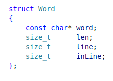
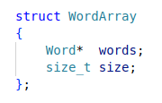

# Fileread
## Краткое описание сути проекта
В данном проекте реализован простейший парсер текстовых файлов на языке С с элементами С++.\
На вход программа получает текстовый файл, а на выходе строит массив структур, содержащих такую информацию о слове из файла, как:
<br>
-Само слов (const char*)
-Длина слова\
-Номер строки, на котором располагается слово\
-Позиция в строке, с которой начинается слово

\
*описания структуры `Word` на языке С*

Массив таких структур хранится внутри еще одной структуры - `WordArray'. Помимо описанного массива она содержит его длину (количество слов в файле).

\
*описания структуры `WordArray` на языке С*

<br>

# Работа с проектом
(На конкретных примерах работу программы можно посмотреть в файле main.cpp)\
Данная программа предлагает 2 основные функции для работы:

```C
WordArray ReadBufferFromFile (const char* file     );
void      BufferDtor         (WordArray*  wordArray);
```
## Чтение файла (ReadBufferFromFile)

На вход данная функция получает имя файла (который нужно распарсить) - `file`.
Возвращает функция структуру `WordArray`, которая содержит количество слов в файле (`.size`) и сам массив слов (`.words`). 
```C
WordArray ReadBufferFromFile (const char* file);
```

## Освобождение памяти (BufferDtor)

В ходе своей работы функция `ReadBufferFromFile` аллоцирует память, поэтому во избежание утечек памяти рекомендуется эту память освобождать перед завершением Вашей программы. Для этого реализована функция `BufferDtor`. Она получает на вход структуру `WordArray` и освобождает память. Данная функция ничего не возвращает.
```C
void BufferDtor (WordArray*  wordArray);
```

## Приятный бонус

Так же проект предлагает для работы 2 функции `WordToInt` и `WordToDouble`, конвертирующие строку из слова в `int` и `double` соотвественно, или обрывающие программу (`exit(1)`) в случае если строка не является целым числом или числом с плавающей точкой.
```C
int    WordToInt    (const Word* word);
double WordToDouble (const Word* word);
```

<br>
# Описание работы алгоритма чтения файла:

```C
WordArray ReadBufferFromFile(const char* file)
{
    assert(file);

    FILE* filePtr = fopen(file, "rb");

    if (!filePtr)
    {
        fprintf(stderr, "failed open '%s'.\n", file);
        return {};
    }

    size_t bufferLen     = CalcFileLen(file);
    size_t realBufferLen = bufferLen + 2;

    char* buffer = (char*) calloc (realBufferLen, sizeof(*buffer));
    Word* words  = (Word*) calloc (realBufferLen, sizeof(*words));

    assert(buffer);
    assert(words);

    Fread(buffer, bufferLen, filePtr);
    fclose(filePtr);

    buffer[bufferLen    ] = ' ';
    buffer[bufferLen + 1] = '\0';


    SetNullWord(&words, buffer);

    Pointer pointer = 
    {
        .wp  = 0,
        .lp  = 1,
        .sp  = 1,
        .bp  = 0,
        .wbp = 0,
    };


    if (!IsPassSymbol(buffer[0]))
        SetWordAndFilePosition(words, &buffer[0], &pointer);

    for (; pointer.bp < realBufferLen; pointer.bp++)
    {
        if (!IsPassSymbolAndChangePointer(buffer[pointer.bp], &pointer))
        {
            pointer.sp++;
            continue;
        }

        size_t previousWordLen = GetPreviousWordLen(&pointer);

        do
        {
            buffer[pointer.bp] = '\0';  
            pointer.bp++;
        } while (IsPassSymbolAndChangePointer(buffer[pointer.bp], &pointer));
        
        SetPreviousWordLen(words, &pointer, previousWordLen);
        SetWordAndFilePosition(words, &buffer[pointer.bp], &pointer);

        pointer.sp++;
        pointer.wbp = pointer.bp;
    }

    size_t wordsQuant = pointer.wp - 1;

    WordArray wordArray = {words, wordsQuant};

    ReadBufRealloc(&wordArray);

    return wordArray;
}
```
Особенностью данного алгоритма является то, что он проходится по тексту лишь *один* раз. В этом есть проблема, ведь мы не можем знать количество слов заранее (в отличии от размера файла). Поэтому изначально память выделяется на весь файл, а уже после обработки файла его длина приводится к нужной с помощью `realloc`. 
Опытный программист может однако возразить, что оптимальность скорости может быть нарушена при реалокации, ведь если `realloc` не сможет продлить массив в памяти, он его перекопирует в другое место. Однако в данном алгоритме размер массива исключительно уменьшается, поэтому со временем все в порядке.
Таким образом имеем, что алгоритм оптимален по времени, но требует перерасхода памяти в самом начале, но в конце отдает все ненужную себе память обратно. 

